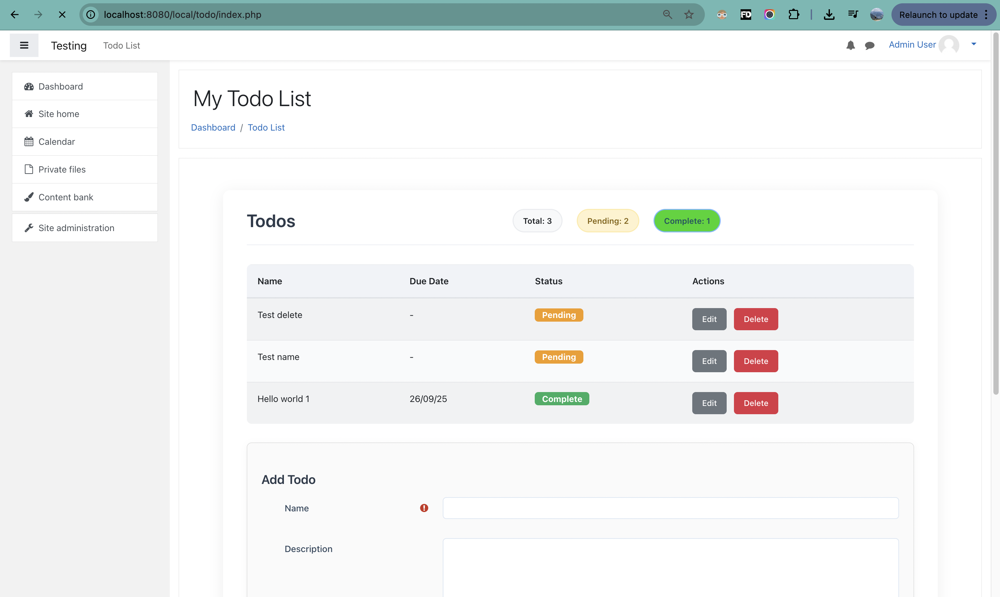
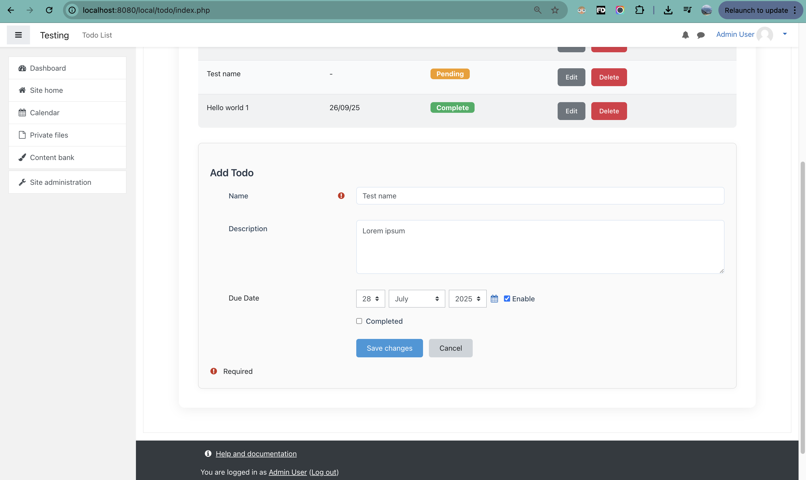
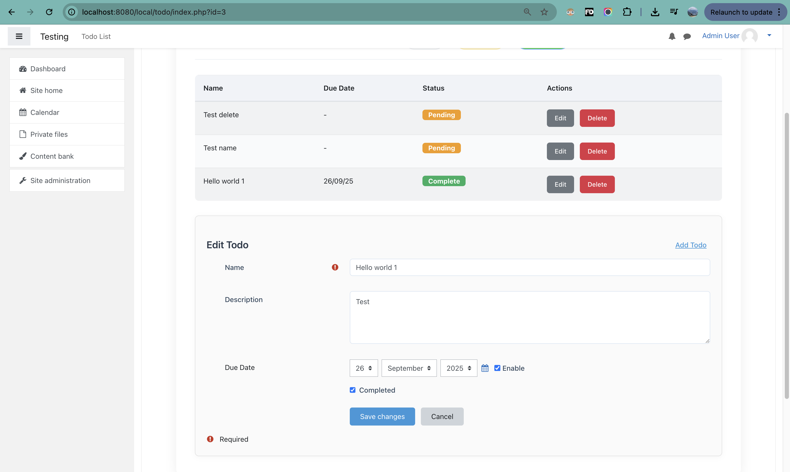
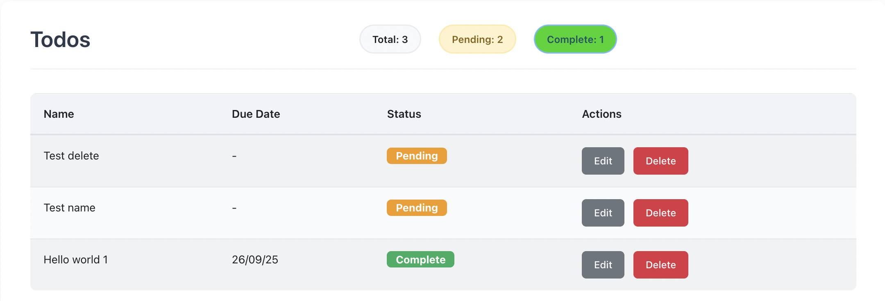
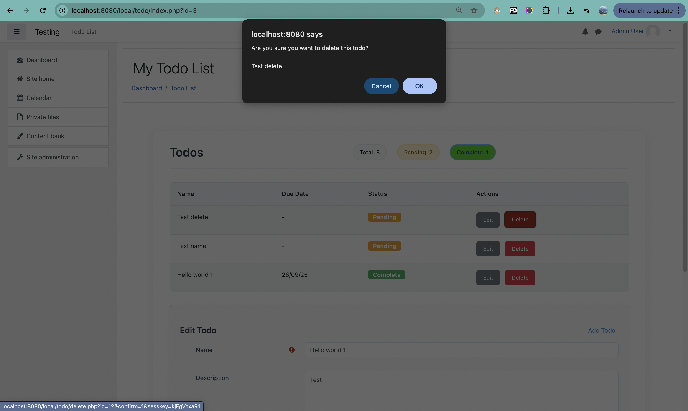
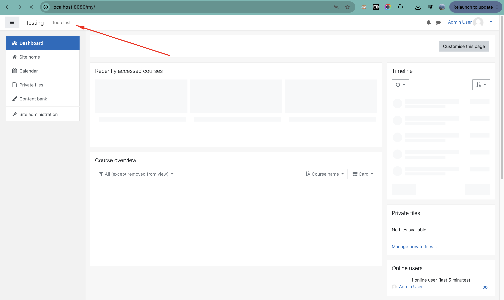

# Moodle Todo Plugin

A comprehensive todo list management plugin for Moodle that enables users to create, edit, delete, and manage their personal todo items through a modern, user-friendly interface.

## Project Overview

This project demonstrates the complete development lifecycle of a Moodle local plugin, including:
- Complete Moodle environment setup using Docker containers
- Custom plugin development following Moodle coding standards
- Implementation of CRUD operations with proper security measures
- Modern UI/UX design with responsive layout

**Repository:** https://github.com/t0nn1x/moodle-todo-plugin

### Core Features

- Create, edit, and delete todo items
- Due date management with validation
- Status tracking (pending/completed)
- Statistics dashboard showing total, pending, and completed todos
- Modern, responsive UI with custom styling
- Proper Moodle capabilities and permissions system
- Full internationalization support
- Mobile-friendly responsive design

## Installation and Setup

### Prerequisites

- Docker and Docker Compose
- Git for version control
- Web browser for Moodle interface

### Project Environment Setup

1. **Clone the Repository**
```bash
git clone https://github.com/t0nn1x/moodle-todo-plugin
cd moodle
```

1. **Start Docker Services**
```bash
docker-compose up -d
```

**Docker Configuration:**
- Database: MariaDB 10.11 (port 3306)
- Web Server: PHP 7.4 with Apache (port 8080)
- Persistent volumes for database and Moodle data

3. **Complete Moodle Installation**
- Navigate to `http://localhost:8080`
- Follow the installation wizard
- Configure database connection:
  - Database type: MariaDB
  - Host: `db`
  - Database: `moodle`
  - Username: `moodleuser`
  - Password: `moodlepass`

4. **Administrator Setup**
- Create admin user account
- Configure site settings 

## Technical Architecture

### Directory Structure

```
local/todo/
├── classes/
│   ├── form/
│   │   └── todo_form.php          # Moodle form implementation
│   ├── output/
│   │   └── renderer.php           # Template rendering logic
│   └── todo_manager.php           # Business logic layer
├── db/
│   ├── access.php                 # Capability definitions
│   └── install.xml                # Database schema definition
├── lang/en/
│   └── local_todo.php             # Internationalization strings
├── templates/
│   ├── index.mustache             # Main interface template
│   ├── header.mustache            # Statistics header template
│   ├── table.mustache             # Todo list table template
│   └── form_wrapper.mustache      # Form container template
├── delete.php                     # Deletion handler
├── edit.php                       # Creation/editing interface
├── index.php                      # Main application entry point
├── lib.php                        # Plugin library functions
├── styles.css                     # Custom stylesheet
└── version.php                    # Plugin metadata
```

### Database Schema

The plugin implements a `local_todo` table with the following structure:

| Field | Type | Constraints | Description |
|-------|------|-------------|-------------|
| id | int(10) | PRIMARY KEY, AUTO_INCREMENT | Unique identifier |
| userid | int(10) | FOREIGN KEY (user.id) | Owner user reference |
| name | varchar(255) | NOT NULL | Todo item title |
| description | text | NULL | Optional description |
| duedate | int(10) | NULL | Unix timestamp for due date |
| completed | tinyint(1) | DEFAULT 0 | Completion status |
| timecreated | int(10) | NOT NULL | Creation timestamp |
| timemodified | int(10) | NOT NULL | Last modification timestamp |

### Capability System

The plugin defines three granular capabilities:

- `local/todo:view` - Permission to view todo items
- `local/todo:manage` - Permission to create and modify todos
- `local/todo:delete` - Permission to delete todo items

All capabilities are assigned to authenticated users by default at the user context level.

## Feature Documentation

### Dashboard Interface

The main dashboard provides comprehensive todo management functionality.



**Interface Components:**
- Real-time statistics display (Total, Pending, Completed counts)
- Sortable data table with all user todos
- Contextual action buttons for item management
- Integrated creation form

### Todo Creation

Users can create new todo items through a validated form interface.



**Form Features:**
- Name field with length validation (maximum 255 characters)
- Optional description textarea
- Due date selector with past date validation
- Completion status checkbox
- Client-side and server-side validation

### Todo Management

Existing todos can be modified through the same form interface with pre-populated data.



### List View

The todo list provides a comprehensive overview of all items with status indicators.



**Table Features:**
- Visual status indicators (color-coded badges)
- Formatted date display
- Contextual action menus
- Responsive design for various screen sizes

### Deletion Workflow

Safe deletion process with confirmation dialog to prevent accidental data loss.



### Navigation Integration

Seamless integration with Moodle's navigation system.



## User Interface Design

### Design Principles

The plugin implements modern web design principles:

- Clean, card-based layout with subtle shadows and rounded corners
- Intuitive color coding for different states and actions
- Smooth transitions and hover effects for enhanced user experience
- Fully responsive design supporting all device categories
- Consistent typography and spacing following design systems

## Security Implementation

### Security Measures

- **Access Control:** Capability-based permissions using Moodle's security framework
- **CSRF Protection:** Session key validation for all state-changing operations
- **Input Validation:** Comprehensive server-side validation and sanitization
- **Data Isolation:** Users can only access and modify their own todo items

### Code Quality Standards

- PSR-4 compliant autoloading and namespace organization
- Full compliance with Moodle coding standards
- Comprehensive error handling with appropriate user feedback
- Database abstraction using Moodle's Data Manipulation Language (DML)
- Separation of concerns using Mustache templating engine

## Internationalization

The plugin supports full internationalization through:
- Complete English language pack implementation
- Structured string identifiers for easy localization
- Integration with Moodle's language system
- Preparation for multi-language deployment

## Development Notes

### Implementation Decisions

1. **Containerized Development Environment:** Docker implementation for consistent development setup
2. **Template-Based Architecture:** Custom renderer with Mustache templates for maintainable UI
3. **Centralized Business Logic:** Manager class pattern for clean code organization
4. **Moodle Form API Integration:** Leveraging built-in validation and security features
5. **Navigation System Integration:** Proper integration with Moodle's navigation architecture

## License

This plugin is released under the GNU General Public License v3.0 or later, maintaining compatibility with Moodle's licensing requirements.

---

**Project Status:** Complete implementation with all core requirements fulfilled and additional professional enhancements integrated.
